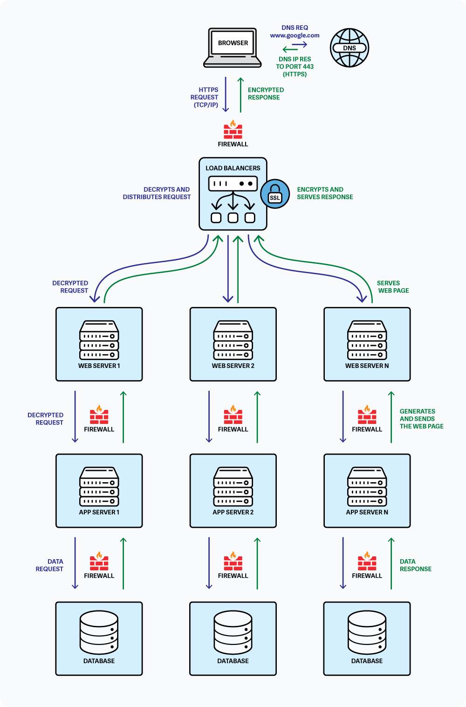

Link to the blog post:https://www.linkedin.com/article/edit/7328699699077537792/

What Happens When You Type google.com in Your Browser and Press Enter?
Have you ever wondered about the complex dance of technologies that occurs in the fraction of a second between typing "https://www.google.com" and seeing Google's familiar search page? This seemingly simple action triggers an intricate series of steps involving multiple layers of the internet stack. Let's dive deep into this fascinating journey.
The Big Picture
Before we examine each component in detail, let's visualize the complete flow of what happens when you type https://www.google.com and press Enter:

The diagram above illustrates the complete journey of your request:

DNS resolution to find Google's IP address
Request traveling through firewalls with HTTPS encryption (port 443)
Load balancer distributing traffic
Web server processing the request
Application server generating dynamic content
Database queries for personalized data
The response traveling back through the same infrastructure

The Journey Begins: DNS Request
When you hit Enter, your browser first needs to figure out where google.com actually lives on the internet. Computers communicate using IP addresses (like 142.250.185.78), not human-friendly domain names. This is where the Domain Name System (DNS) comes in - it's like the internet's phonebook.
Here's what happens:

Your browser checks its cache to see if it recently looked up google.com
If not found, it checks your operating system's DNS cache
Still nothing? Your computer asks your router
The router might have it cached, or it forwards the request to your ISP's DNS server
If the ISP's DNS server doesn't know, it starts a recursive lookup:

It asks the root DNS servers ("Hey, who handles .com domains?")
The root servers point to the .com TLD (Top Level Domain) servers
The .com servers say "Google's name servers handle google.com"
Finally, Google's name servers respond with the IP address

This entire process usually takes just milliseconds, but it's crucial for connecting you to the right server.
Establishing the Connection: TCP/IP
Now that we have Google's IP address, your browser needs to establish a connection. This is where TCP/IP (Transmission Control Protocol/Internet Protocol) comes into play.
TCP/IP works in layers:

Application Layer: Where HTTP/HTTPS operates
Transport Layer: TCP ensures reliable data delivery
Internet Layer: IP handles addressing and routing
Network Interface Layer: The physical transmission

The connection process follows these steps:

Your browser initiates a TCP connection using a "three-way handshake":

SYN: "Hey Google, want to talk?"
SYN-ACK: "Sure, I'm listening!"
ACK: "Great, here's my first request"

Since we're using HTTPS (the secure version), there's an additional TLS/SSL handshake to establish encryption

Security Checkpoint: Firewall
As data packets travel between your computer and Google's servers, they pass through multiple firewalls. These security gatekeepers examine each packet to ensure it meets certain rules:

Your personal computer's firewall checks outgoing connections
Your router/home network firewall provides another layer
Your ISP may have firewalls
Google's infrastructure has multiple firewall layers protecting their servers

Firewalls check things like:

Is this connection allowed?
Is the port number valid (HTTPS uses port 443)?
Does the traffic pattern look suspicious?

Securing the Connection: HTTPS/SSL
HTTPS ensures that your connection to Google is encrypted and secure. This prevents anyone from eavesdropping on your searches or hijacking your session.
The TLS/SSL handshake process includes:

Certificate Exchange: Google's server sends its SSL certificate, which your browser verifies against trusted Certificate Authorities
Key Exchange: Both parties agree on encryption methods and exchange keys
Secure Connection: All data is now encrypted using these keys

This encryption is why you see the padlock icon in your browser's address bar.
Distributing the Load: Load Balancer
Google handles billions of requests daily. They don't rely on a single server - instead, your request hits a load balancer first. This traffic director:

Distributes incoming requests across thousands of servers
Monitors server health and availability
Routes requests based on geographic location (you'll likely hit a data center near you)
Ensures no single server gets overwhelmed
Provides redundancy if servers fail

Google uses sophisticated load balancing algorithms considering factors like:

Current server load
Geographic proximity
Server specialization
Current network conditions

Processing the Request: Web Server
Your request finally reaches one of Google's web servers (they primarily use Google Web Server, GWS). The web server:

Receives your HTTPS request
Processes the HTTP headers
Determines what resource you're requesting (in this case, the Google homepage)
Checks if the content can be served from cache
If not, forwards the request to the application server

Web servers are optimized for serving static content quickly and efficiently. They handle tasks like:

SSL termination
Request routing
Static file serving
Basic security checks

The Brains: Application Server
For dynamic content, the web server passes your request to an application server. At Google, this involves their custom-built infrastructure. The application server:

Executes the business logic
Determines if you're logged into a Google account
Personalizes the page based on your preferences
Prepares the search interface
May pre-fetch suggestions based on trending searches

Google's application servers are written in various languages (C++, Java, Python, Go) and are highly optimized for performance.
Data Retrieval: Database
While the Google homepage itself might not require extensive database queries, the application server often needs to fetch data:

User preferences and settings
Recent search history (if you're logged in)
Trending searches for autocomplete
Personalization data

Google uses various database technologies:

Bigtable: Their distributed storage system
Spanner: Globally distributed relational database
Various caching layers: To speed up common queries

The database queries are optimized to return results in milliseconds, often using:

Distributed caching (like Memcached)
Read replicas for load distribution
Sharding for horizontal scaling

The Response Journey
Once the application server has assembled the response, the data travels back:

Application server sends the HTML/CSS/JavaScript to the web server
Web server compresses the response (usually with gzip)
The response is encrypted via HTTPS
It travels back through the load balancer
Through various networks and firewalls
Finally arriving at your browser

Browser Rendering
Your browser receives the response and:

Decrypts the HTTPS data
Parses the HTML to build the DOM (Document Object Model)
Processes CSS to build the CSSOM (CSS Object Model)
Executes JavaScript
Renders the page you see

The entire process, from pressing Enter to seeing the Google homepage, typically takes less than a second - a testament to the incredible optimization at every layer.
Conclusion
What seems like a simple action - typing a URL and pressing Enter - actually involves a complex orchestration of technologies. From DNS lookups to database queries, from security protocols to load balancing, each component plays a crucial role in delivering the web experience we often take for granted.
Understanding this flow isn't just academic - it's practical knowledge that helps developers:

Debug connection issues
Optimize application performance
Design better architectures
Appreciate the importance of each layer

The next time you visit Google (or any website), take a moment to appreciate the incredible engineering that makes it all possible. In less than a second, your request has traveled potentially thousands of miles, through dozens of systems, all working in perfect harmony to deliver the content you requested.
